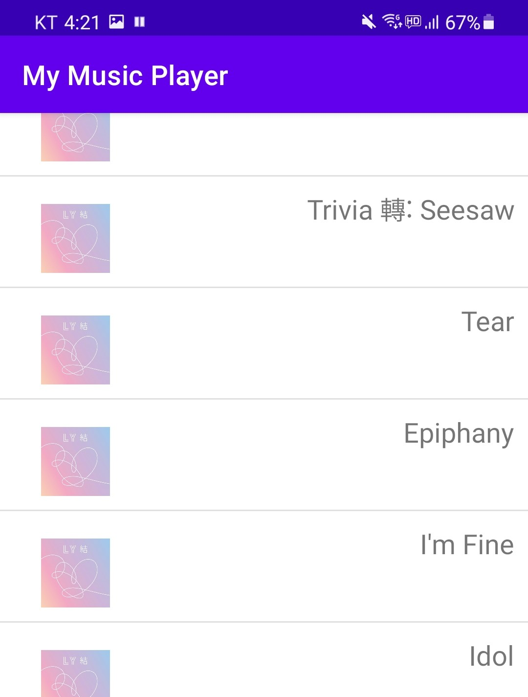
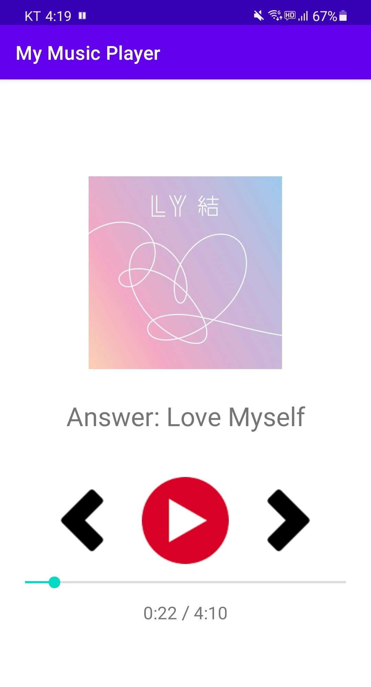
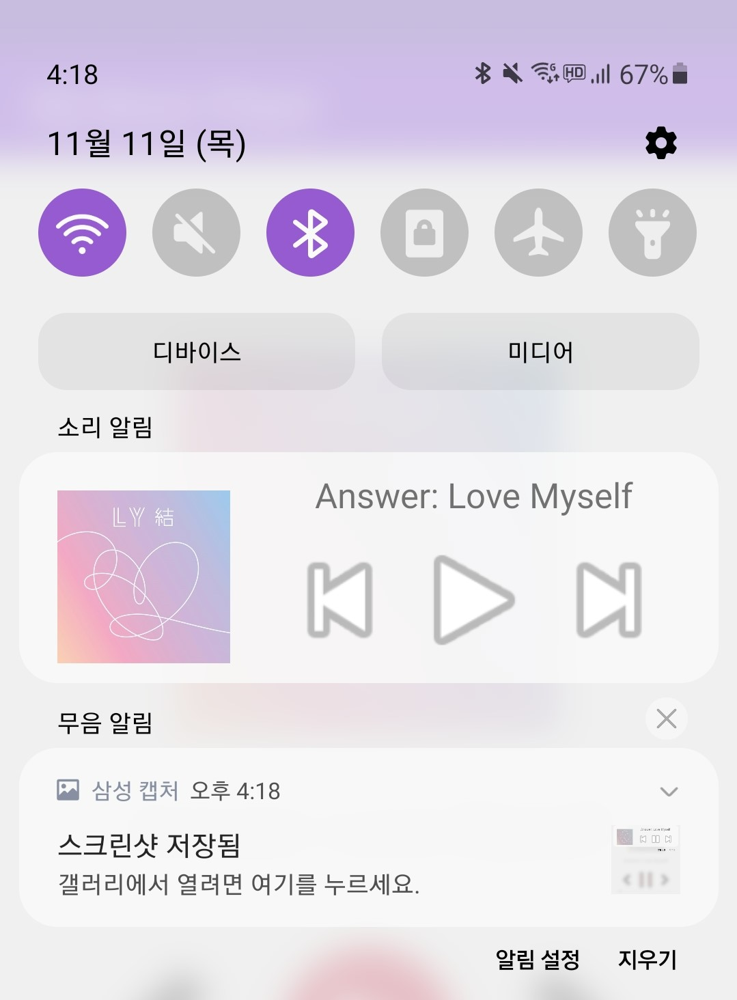
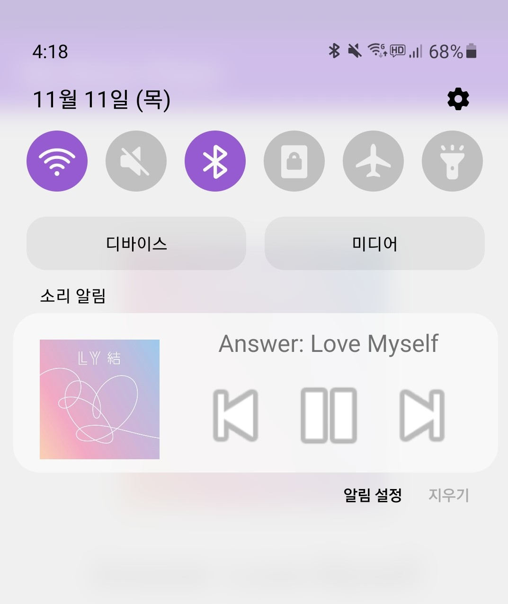

# Android Music Player

## 트랙 재생
기본적인 음악 재생의 기능을 갖춤.

## 알림창 컨트롤
custom noification으로 알림창을 이용한 재생 컨트롤 기능을 갖춤

# Screen Shot
-------------

재생할 음악 선택 Activity 화면   

음악 재생 Activy 화면   

음악 재생 및 일시정지 상태의 알림창   
